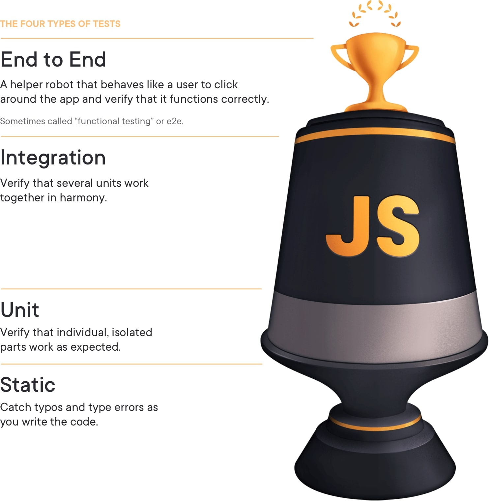

UI 통합 테스트를 작성하다보면 몇가지 문제를 마주합니다.

(Jest, React, Typescript 환경 예시)

```tsx
import { mocked } from 'ts-jest/utils';
import { getPostsHook } from './hooks'

jest.mock('./hooks');
const mockedGetPostsHook = mocked(getPostsHook);

it('유저는 자신이 작성한 Post의 리스트를 볼 수 있다', () => {
  mockedGetPostsHook.mockReturnValueOnce(Promise.revolve([
    { title: 'a', ... },
    { title: 'b', ... },
  ]));

  render(Component)

  const items = await screen.findByRole('listitem');

  expect(items.length).toBe(2);
});
```

단벌의 테스트 케이스라면 위 모킹은 문제가 되지 않습니다. 하지만

- 테스트 케이스가 늘어날 경우
- `getPostsHook`을 여러곳에서 사용할 경우
- 모킹할 함수가 늘어나거나, 모킹할 데이터 구조가 복잡해질 경우

다음과 같은 문제가 발생합니다.

1. 모킹 코드때문에 테스트 코드 자체의 가독성이 떨어진다. *단 몇 줄의 테스트코드를 위해 몇십 줄이 넘는 Mocking코드가 하나의 파일*에 필요하다.
2. 데이터 스키마가 바뀔 경우 관리하기 어렵다

> Jest에서 제공하는 Manual Mocks을 사용하면 해결되지 않나?

맞습니다. [Manual Mocks](https://jestjs.io/docs/manual-mocks)을 통해 위 문제들을 *완화*시킬 수 있습니다.

```ts
// __mocks__/hooks.js
const POSTS = [{ title: 'a' }, { title: 'b' }]

export const getPostsHook = () => {
  return Promise.resolve(POSTS)
}
```

테스트코드는 이렇게 변합니다.

```tsx
jest.mock('./hooks')

it('유저는 자신이 작성한 Post의 리스트를 볼 수 있다', () => {
  render(Component)

  const items = await screen.findByRole('listitem')

  expect(items.length).toBe(2)
})
```

:tada: 깔끔해졌군요! 이제 끝일까요?

## 파편화

A라는 유저는 2개의 Post를 작성했다고 가정해보겠습니다. 반면 B라는 유저는 아무런 Post를 작성하지 않았고, 디자인팀은 이런 경우 다른 UI가 그려지길 원합니다.

2개의 다른 케이스를 커버하기 위해 2벌의 테스트를 작성해야합니다. 아까 모킹했던 함수`getPostsHook`는 이에 대응할 수 있을까요?

단순히 생각하면 `__mocks__/hooks.ts` 의 코드를 수정하면 됩니다. 인자를 넘겨 다른 값을 리턴하도록 말이죠. 옳은 방법일까요?

함수는 2개로 파편화 됐습니다. 개발자가 관여하지 않는 이상, 테스트용 함수는 원본 함수의 변경을 감지하지 못합니다. 실제 함수에 버그가 생겨도 테스트용 함수는 제 몫을 하지 못합니다.

## MSW와 MSWJS/data

[MSW](https://mswjs.io/)는 최근들어 주목받는 라이브러리입니다.

> Mock by intercepting requests on the network level. Seamlessly reuse the same mock definition for testing, development, and debugging.

네트워크 호출을 가로채서 seamless한 모킹 경험을 제공하는 것이 핵심입니다. 그리고 [@mswjs/data](https://github.com/mswjs/data) 라는 모듈을 추가적으로 제공합니다.

> Model and query your mock data (fixtures).

간단히 이야기하자면, MSW Ecosystem으로 프론트엔드 프로젝트 안에 우리만의 서버를 만들 수 있게됐습니다! 테스트 환경에서든, 브라우저 환경에서든 말이죠.(후자의 경우 [Mocking으로 생산성까지 챙기는 FE 개발 – tech.kakao.com](https://tech.kakao.com/2021/09/29/mocking-fe/) 에서 자세하게 살펴보실 수 있습니다)

아래는 테스트 환경의 예시 코드입니다. 최대한 책임을 분리하여 작성했습니다.

```js
// schema.js
import { factory, primaryKey } from '@mswjs/data'

export const schema = {
  post: {
    id: primaryKey(String),
    title: String,
  },
}

// seed.js
export const runMigration1 = db => {
  db.post.create({ id: '1', title: 'Hello' })
  db.post.create({ id: '2', title: 'Bye' })
}

// db.js
import { factory } from '@mswjs/data'
import { migration1 } from './seed'
import schema from './schema'

const db = factory(schema)
runMigration1(db)

export default db

// server.js
import { rest } from 'msw'
import { setupServer } from 'msw/node'
import db from './db'

// setupServer의 인자로 들어간 handler도 파일을 분리할 수 있지만
// 편의를 위해 한곳에 작성했습니다.
export const server = setupServer(
  rest.get('/posts', (req, res, ctx) => {
    const posts = db.post.getAll()
    return res(ctx.json(posts))
  })
)
```

간단하게 만드려 했지만, 사실 꽤나 품이 많이 듭니다.

```js
/* setupTest.js */
import { server } from './server'

// 테스트 전에 모든 요청을 intercept하는 layer 생성
beforeAll(() => server.listen())

// 요청 interception layer를 제거하여 side effect 차단
afterAll(() => server.close())

/* 테스트 파일 */
test('Post 데이터를 렌더링 한다', () => {
  render(Component)

  const items = await screen.findByRole('listitem');

  expect(items.length).toBe(2);
})
```

이제 더이상 테스트 코드 안에 Mocking 코드는 존재하지 않습니다. 이로써

- 가독성 확보
- 코드 파편화 방지(원본 코드를 그대로 사용)
- 그리고 Fixture의 형태, 필드 타입, 관계 정의 및 관리 용이성 확보
  가 가능해졌습니다.(아직 설명 하지 않았지만 mswjs/data로 데이터간 relation도 정의할 수 있습니다)

## 실전 예시

조금더 실전적인 시나리오를 작성해 봅시다. User와 Post관계를 정립하고, Post를 작성한 경우, 작성하지 않은 경우 2벌의 테스트를 작성해야하고 유저의 세션관리도 필요합니다.

```js
// schema.js
import { manyOf, nullable, oneOf, primaryKey } from '@mswjs/data';

export const schema = {
  user: {
    id: primaryKey(String),
    name: String,
    posts: manyOf('post')
  },
  post: {
    id: primaryKey(String),
    title: String,
    body: String,
  },
}

// seed.js
export const runMigration = () => {
  const posts = [
    db.post.create({ id: '1', title: 'Hello' })
    db.post.create({ id: '2', title: 'Bye' })
  ]

  db.user.create({ id: '1', name: 'has-posts', posts })
  db.user.create({ id: '2', name: 'no-posts', posts: [] })
}

// session.js
// 프로젝트 별로 세션관리는 상이하며, 이에따라 구현은 달라질 수 있습니다
import crypto from 'crypto';

let sessionStorage = {};

export function getAuthToken(request) {
  return request.headers.get('authorization')?.split(' ')[1];
}

export function getSessionUser(request) {
  const token = getAuthToken(request);
  return sessionStorage[token];
}

export function setSessionUser(user) {
  const token = crypto.randomBytes(16).toString('hex');
  sessionStorage[token] = user;
  return token;
}

export function clearSession() {
  sessionStorage = {};
}

// handlers.js
export const handlers = [
  rest.post("/login", (req, res, ctx) => {
    const { login } = req.variables;

    const user = db.account.findFirst({
      where: { id: { equals: login } },
    });

    const token = setSessionUser(user);

    return res(ctx.json({ token, user }));
  }),

  rest.get("/posts", (req, res, ctx) => {
    const user = getSessionUser(req);
	  return res(ctx.json({ posts: user.posts }))
  }),

  rest.get("/posts/:postId", (req, res, ctx) => {
    const { postId } = req.params
    const user = getSessionUser(req);
    const post = user.posts.findOne({
      where: {
        id: {
          equals: postId
        }
      }
    });

	  return res(ctx.json({ post }))
  }),
]
```

아래는 테스트용 로그인 helper 컴포넌트와 hook예시입니다. 클라이언트의 세션관리 또한 프로젝트마다 구현이 다릅니다.

- cookie를 사용하거나 jwt 토큰을 사용할 수 있습니다.
- 토큰의 경우 `localStorage`나 `sessionStorage`를 사용할 수 있습니다.

디테일한 부분은 넘어가고 진행하겠습니다

```js
function LoginRoot({ children, login }) {
  const loggedIn = useLogin(login)

  if (loggedIn) {
    return <Suspense fallback="Loading...">{children}</Suspense>
  }

  return null
}

function renderWithLogin(component, login) {
  return render(<LoginRoot login={login}>{component}</LoginRoot>)
}
```

이제 테스트를 작성해봅시다.

```js
test('Post를 작성한 유저는 모든 Post를 볼 수 있고 클릭하면 포스트 내용을 볼 수 있다.', () => {
  renderWithLogin(Component, 'has-posts');

  const items = await screen.findByRole('listitem');

  expect(items.length).toBe(2);

  await userEvent.click(items[0]);

  expect(window.location.pathname).toBe('/posts/1');

  const title = getByRole('heading', { level: 1 });

  expect(title.textContent).toBe('Hello');
})

test('Post를 작성하지 않은 유저는 `글쓰기` 버튼을 노출한다. 버튼을 클릭하면 글쓰기 페이지로 이동한다', () => {
  renderWithLogin(Component, 'no-posts');

  const button = await screen.findByRole('button', { name: '글쓰기' });

  expect(button).toBeInDocument();

  await userEvent.click(button);

  expect(window.location.pathname).toBe('/posts/new')
})
```

모킹하는 부분이 사라지면서 테스트 로직에 온전히 집중할 수 있습니다. 또한 프론트에 존재하는 모든 코드를 커버함과 동시에 유연하게 데이터를 모킹하는 것이 가능해졌습니다.

## MSW 꼭 써야하나요?

**아니요.** 여기에 몇가지 고려사항이 있습니다.

### 복잡해요

모든것엔 Trade-Off가 있습니다. MSW를 통해

- 테스트 코드 가독성
- 모킹데이터 관리 용이성

를 얻었지만, 반면

- 테스트를 setup하는데 많은 준비가 필요하다.
- 네트워크 호출 레이어까지 코드가 동작하고, server/handler/db 동작까지 포함돼 테스트 시간이 증가한다.
- 서버로직이 바뀌면 handler도 바뀌어야한다. 즉 관리 포인트가 증가한다.

모든 테스트를 MSW와 함께 작성하고 이를 유지보수하기란 쉽지 않습니다. 따라서

- 실패하면 안되는 Critical한 UI 테스트(예: 가입/로그인/결제 등)
- 복잡한 Mocking 데이터가 많이 필요한 테스트

위와 같은 경우 MSW를 활용하여 UI 통합 테스트를 작성하시길 권해드립니다.

### 차라리 E2E 테스트를 작성하는게 낫지 않나요?

handler 같은 코드를 관리할 필요 없이, 이미 존재하는 백엔드 서버를 띄우고 Cypress 같은 서비스를 더하면 더 완벽한 테스트가 될 수 있습니다.

하지만 이는 큰 비용을 지불해야 가능합니다. 테스트 무결성을 위해 DB를 새로 띄워야하며 혹여 MSA로 운영중이라면 서버를 여러개 띄워야합니다. Cypress나 TestCafe같은 툴 또한 도입하는데 시간이(프레임워크에 따라 비용지불까지) 필요합니다.

여러분의 회사에서 이 모든 환경을 지원한다면... 부럽습니다. 연락 주시겠어요? 지원하고 싶습니다. 잘 부탁드립니다 :person_bowing:

#### Testing Trophy

[Kent C. Dodds](https://kentcdodds.com/)는 블로그나 강연에서 테스팅 트로피를 자주 언급합니다.



- Linter를 통해 Static한 버그를 잡고
- 단일 모듈은 Unit Test를 통해 관리하며
- Integration Test를 통해 전체 앱이 조화롭게 동작하는지 확인합니다
- E2E 테스트를 통해 종단간 주요 경로를 테스트합니다.

트로피 상단으로 갈수록 비용이 증가합니다. 이 때문에 E2E를 통해 모든 커버리지를 달성하기 보다, 통합 테스트를 최대한 활용하길 권장합니다.

MSW는 E2E에 비해 비용이 무척 저렴한 편이니 Golden Path 테스트에 제격이겠습니다.

### 튼튼한 제품을 위한 여정

후... 생각보다 긴 여정이었습니다. 두말하면 입 아프지만, 안정적인 서비스를 제공하기 위해 테스트는 필수입니다. MSW로 여러분들의 프로덕트가 한층 더 견고해지길 바랍니다.(그리고 야근도 줄어들길 기원합니다 :pray:)

긴 글 읽어주셔서 감사합니다 :smile:
