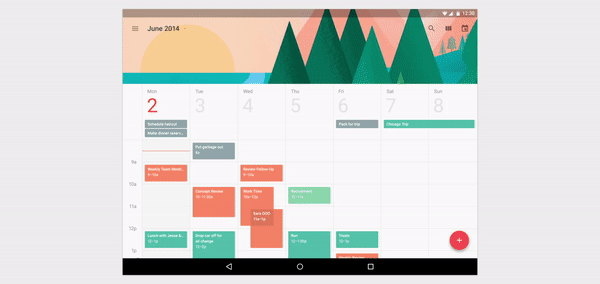
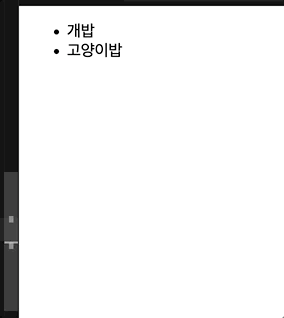
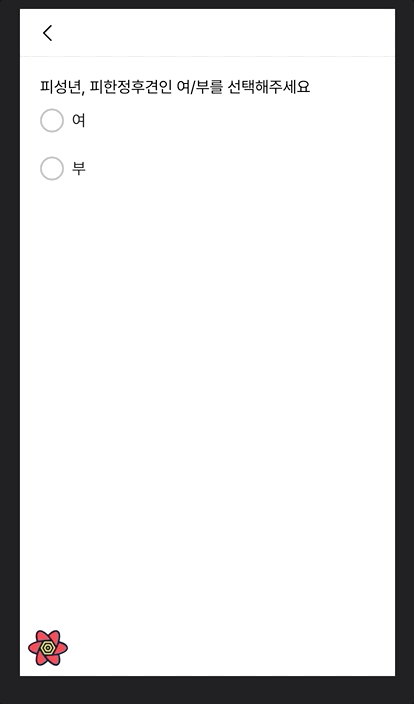
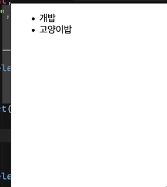

들어가기 앞서 Visual Feedback을 통해 유저에게 더 나은 경험을 제공할 수 있다는 것을 짚고 넘어가려 합니다. 동적임에도 정적으로 느껴지는 UI는(_DOM Element가 ‘띡'하고 나타났다 사라지는 등_) 유저에게 미세한 인지부하를 일으킬 수 있습니다. 컨텍스트가 '전환’되는 상황을 유저 스스로의 힘으로 파악해야 합니다. 개발자가 조금 더 신경쓴다면 이는 큰 UX 개선으로 이어질 수 있습니다.



하지만 슬프게도, 당장 기능개발이 필요한 상황에 놓인 프론트 개발자에게 UX 개선은 늘 우선순위에서 뒤쳐지기 마련입니다. 공부해야할 것도 많고, 막상 찾아보면 hacky한 코드들을 많이 마주하게 됩니다.(특히나 React에서 구현하려면…) 네, UX관련 Task를 내려놓는 소리가 들리네요. 🙁 하지만 FLIP과 WAAPI가 우리를 도와줄겁니다!

```jsx
// FLIP Before the WAAPI
el.style.transform = `translateY(200px)`

requestAnimationFrame(() => {
  el.style.transform = ''
})
```

## FLIP? 그게 뭔데?

JS를 이용하여 DOM 요소의 `width, height, top, left` 를 계산하여 애니메이션을 만들 때, **버벅거림**을 경험할 수 있습니다. 앞선 property들의 변경은 Layout 변경을 유발하고, 브라우저는 다른 요소들의 Layout 또한 다시 계산해야하기 때문에 재귀적으로 문서의 모든 요소를 순회해야합니다. 이때 만약 해당 연산이 16.7ms를 넘어간다면, 그순간의 애니메이션 프레임은 화면에 그리지 않고 유저는 **버벅임을** 느끼게 됩니다. 사람의 눈은 초당 60개 이상의 프레임(60 fps, 프레임당 16.7ms) 이상으로 그려지는 애니메이션에서 자연스러움을 느끼기 때문입니다.

1. **F**irst:애니메이션 변경이 생길 요소의 현재 상태(위치, 높낮이)를 캐싱합니다. `Element.getBoundingClientRect()` 를 사용합니다.
2. **L**ast: 변경을 유발하는 코드를 실행시켜서 즉시 최신 상태(위치, 높낮이)를 얻고 이를 기록합니다. 아직 Reflow단계이므로 화면에는 마지막 상태가 그려지지 않았습니다.
3. **I**nvert: 여기서 약간의 시각적 트릭을 사용합니다. 앞선 단계에서 캐싱했던 첫 혹은 이전 상태로 `keyframe`을 되돌립니다. `WAAPI` 의해 수행됩니다. DOM요소를 변경전 상태의 위치/높낮이로 그려냅니다. 마치 아직 변경이 발생하지 않은 '척'합니다.
4. **P**lay: 마찬가지로 `WAAPI`를 사용하여 `keyframe`을 최신상태로 만들어 애니메이션을 재생시킵니다.

Pau Lewis는 그의 [블로그](https://aerotwist.com/blog/flip-your-animations/)에서 이를 처음 소개했습니다.

## 그럼 WAAPI는 뭐야?

[MDN 문서](https://developer.mozilla.org/en-US/docs/Web/API/Web_Animations_API)에서 잘 설명해주고 있으며, 지금 우리가 알아둘 것은 `Element.animate()` 입니다. 우리의 코드를 매우 우아하게 만들어줄 메서드입니다.

## React의 렌더링 사이클

React의 예시에서 이 FLIP테크닉을 사용하기 위해 다음 메서드를 이용합니다.

- `useEffect` Paint 이후 콜백 실행. 최초의 캐싱
- `useLayoutEffect`: Paint이전 동기적으로 콜백 실행. 여기서 얻은 DOM은 변경된 값들을 갖고 있으므로, 이전 캐시값과 함께 사용하여 `transform` 시킬 수 있음.

## 예시 코드

```tsx
const NEW_ITEMS = ['말밥', '소밥', '개구리밥', ...]

function Flipper() {
  const rectMap = React.useRef<Map<string, DOMRect>>(new Map()).current;
  const [items, setItems] = React.useState(['개밥', '고양이밥'])

  // 최초 캐싱
  React.useEffect(() => {
    const elements = Array.from(
      document.querySelectorAll<HTMLLIElement>('.flipper'),
    );

    elements.forEach((el) => {
      rectMap.set(el.id, el.getBoundingClientRect());
    });
  }, [rectMap]);

  React.useLayoutEffect(() => {
    const elements = Array.from(
      document.querySelectorAll('.flipper'),
    );

    elements.forEach((el) => {
      const cachedRect = rectMap.get(el.id);

      if (cachedRect) {
        const nextRect = el.getBoundingClientRect();

        el.animate([
          {
            transform: `translateY(${cachedRect.top - nextRect.top}px)`,
          },
          {
            transform: `translateY(0px)`,
          },
        ], {
          duration: 300,
          easing: 'ease-in-out',
        });

        rectMap.set(el.id, nextRect);
      }
    });
  }, [rectMap, items]);

  return (
    <ul>
      {items.map((item) => {
        return (
          <li id={item} className="flipper" onClick={() => {
            const newItems = items.slice();
            newItems.unshift(NEW_ITEMS.pop())
            setItems(newItems)
          }}>
            {item}
          </li>
        );
      })}
    </ul>
  );
}
```



위 코드를 살짝 응용하면 opacity까지 추가된 애니메이션을 구현할 수 있습니다.



## 꼭 useLayoutEffect를 써야할까?

프론트팀 동료인 [Jayden](https://github.com/parkoon)의 호기심으로 `useLayoutEffect` 가 아닌 `useEffect`만 사용하면 어떨까 실험아닌 실험을 해봤습니다. 예상대로라면, `useEffect`의 콜백은 화면이 그려진 후 호출되므로

1. 아주 잠깐 DOM요소가 최신 상태로 그려졌다가
1. FLIP의 I 단계로 인해 이전상태로 되돌아간뒤
1. 다시 제자리를 찾아가는 괴상한 애니메이션이 그려질것

하지만 실험결과는 너무나 정상적인 애니메이션이 그려졌습니다. 머신이 빨라서(맥북 Pro) 사람 눈으로 인지를 못하나 싶어 개발도구 옵션으로 CPU제한을 걸고 고급 페인트 계측을 설정하여 오버헤드를 주어 봤지만 여전했습니다.

미스터리를 해결하지 못한채 퇴근 후 CodeSandbox에서 위 코드를 동작시켜 봤습니다. `useLayoutEffect`가 아닌 `useEffect`만으로요. 그랬더니...



여러번 시도해본 결과 `useEffect`를 사용하면 간헐적으로 위와같이 '버벅거림'이 발생했습니다. 하지만 `useLayoutEffect`를 사용하면 저런 현상이 재현되지 않았습니다.(이또한 여러번 시도해 보았습니다)

제한적인 리소스 환경을 고려하여 렌더링 이전에 동기적으로 실행이 보장되는 `useLayoutEffect`가 더 안전한 사이클 훅이었다는 결론을 얻었습니다.

## 애니메이션에 관심있는 프론트 엔드 개발자라면

FLIP 테크닉을 이용하여 이용자 친화적이고 멋진 UI를 만들어 보고싶은 욕구가 뿜뿜하지 않나요? 여러분들의 창의성으로 더욱 아름다워질 웹 생태계가 기대하며 이만 줄이도록 하겠습니다.

---

### References

아래 글들을 참고하여 작성하였습니다.

- [https://css-tricks.com/animating-layouts-with-the-flip-technique/](https://css-tricks.com/animating-layouts-with-the-flip-technique/)
- [https://css-tricks.com/everything-you-need-to-know-about-flip-animations-in-react/](https://css-tricks.com/everything-you-need-to-know-about-flip-animations-in-react/)
- [https://uxplanet.org/functional-animation-in-ux-design-what-makes-a-good-transition-d6e7b4344e5e](https://uxplanet.org/functional-animation-in-ux-design-what-makes-a-good-transition-d6e7b4344e5e)
- [https://www.youtube.com/watch?v=s06Z_e8ac0Y](https://www.youtube.com/watch?v=s06Z_e8ac0Y)
