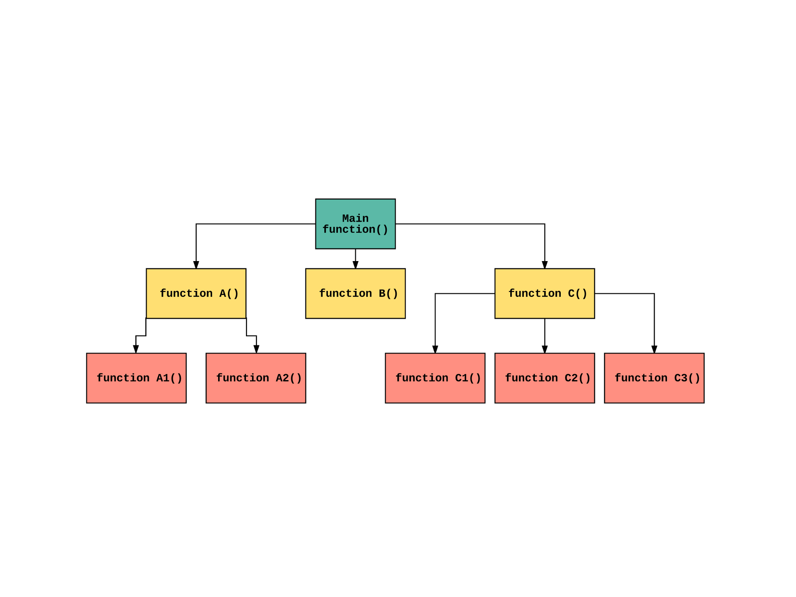

함수형 프로그래밍을 알게 된건 오래 됐지만, 이제서야 조금 더 잘 알게 됐다. 함수형 스타일 도구 사용법이 아니라, 배경을 알고나니 코드작성에 더욱 자신감이 생겼다. 드디어 마음속 오래 묵었던 TODO 하나를 지운 기분이다.

# Functional Programming과 첫 만남

버즈빌에선 매주 수요일 Dev Seminar가 열렸다. 거기서 [Las](https://www.linkedin.com/in/wonho-h-a8a70913b/)가 몇 번 FP에 대해서 발표했다. 때마침 [유인동님의 함수형 프로그래밍 강의](https://www.inflearn.com/users/@indongyoo)를 알게되면서 FP를 알아가기 시작했다. 그러던 차에 맡고있던 업무에 복잡한 계산이 많이 필요했고, 돈:moneybag:과 관련된 로직이었기에 엄밀히 다뤄야할 필요가 있었다. FP의 장점들이 딱 들어맞았기에 _이건가?!_ :hushed: 싶었다.

## 함수형 도구를 쓴다고 FP를 하는건 아니다.

하지만 여전히 코드는 내가 아는 함수형 규칙을 벗어날 때도 있었고, 그럴때마다 Monad니 Kleisli Composition이니 하는 더 어려운 개념들을 탐구했다. 하지만 깊이 머리에 박히지 않았다. 함수형 라이브러리를 덕지덕지 쓴다고 해서 만족스럽지 않았다. 오랜 고민 끝에 완성된 코드가 더 읽기 어려운 경우도 있었다. 장고로 업무 기일이 늘어지는 경우도 생기다보니 FP를 향한 열정도 사그라들었다.

약간의 관심만 남겨 놓은 채 시간이 흘렀고, 우연히 [쏙쏙 들어오는 함수형 코딩](http://www.yes24.com/Product/Goods며08748841)이라는 참으로 웅진 씽크빅 스러운 이름의 책을 알게 됐다. 그래도 뭔가 얻을 것이 있을까 싶어 주문했고, 첫 챕터를 읽으며 오랜만에 마음의 외침이 다시 들렸다.

> 함수형 프로그래머는 액션과 계산, 데이터를 구분한다

_이거 였구나!_ :astonished:

# "왜" FP를 해야하나?

우선 우리가 작성하는 코드는 반드시 아래 3가지로 중 하나로 분류된다는 것을 알아야한다.

## 액션

실행 시점, 횟수나 순서에 의존하여 결과가 달라진다. 이에따라 다음과 같은 요구가 생긴다.

- 시간이 지남에 따라 안전하게 상태를 바꿀 수 있어야한다.
- 순서를 보장해야한다.
- 액션이 정확히 한 번만 실행되게 보장하는 방법이 있어야한다.

## 계산

입력이 동일하다면 출력은 항상 동일하다. 언제 어디서 계산해도 결과는 같다. 외부에 영향을 주지 않는다. 그래서 테스트하기도 쉽고 안전하다. 다음이 뒷받침 돼야한다.

- 정확성을 위한 정적 분석이 필요하다.
- SW에서 사용할 수 있는 수학 지식이 필요하다.
- 테스트 전략이 필요하다.

## 데이터

어떠한 이벤트에 대해 기록한 사실이다. 코드를 실행하지 않아도 알아보기 쉽다. 존재 자체로 의미가 있다. 해석은 천차만별이다. 그리고 이러한 데이터 가치를 높이기 위해서

- 효율적으로 데이터에 접근할 수 있도록 구성해야한다.
- 데이터를 보관해야한다.
- 데이터를 이용해 중요한 인사이트를 발견해야한다.

### 이러한 구분에 무슨 의미가 있나?

비지니스 성장과 함께 어플리케이션 복잡도가 증가하는데, 이는 개발 난이도 상승을 의미한다. 최악의 경우 하나의 기능 추가/변경을 위해 수많은 코드베이스를 뜯어 고쳐야하는 경우도 발생한다. 사실 이런 경우가 거의 모든 회사마다 있어서 '레거시'라는 이름 아래 방치되고 있는 경우가 부지기수다.

또한 네트워크 통신의 발달로 분산 시스템은 굉장히 흔해졌다. 클라우드 상의 서버들과 노트북/스마트폰 같은 디바이스들 사이의 통신은 지금 이순간에도 도처에서 일어나고 있다. 처리해야할 메시지는 순서가 섞이기도 하고, 중복되기도 하고 유실될 수도 있다. FE 입장에서 ajax 호출 순서가 바뀌거나, 실패하는 등등의 상황을 상상해보면 쉽게 이해가 간다. 대체로 골치아픈 일이 생기는 구간이다. **액션에서** 많이 발생한다.

앞서 언급했듯 **데이터와 계산은** 실행 시점이나 횟수에 의존하지 않는다. 코드를 데이터와 계산으로 바꿀수록 분산 시스템의 문제들을 해결할 수 있다. **액션은** 실행 시점, 횟수에 영향을 받는다. 그렇다면 액션을 없애면 모든게 해결될까? 당연히 아니다. 분산 시스템에서 액션은 반드시 필요하다. DB 호출/서버 API 호출 등 액션은 필연적이다.

함수형 프로그래밍은 **액션을 안전하게 다룰 수 있는 기술을** 제공한다. 즉 대다수의 모던 애플리케이션에서 분산 시스템은 필수가 됐고 자연스레 함수형 프로그래밍은 트렌드가 됐다.
사실 함수형 프로그래밍은 갑자기 떠오른 트렌드는 아니다. 객체지향 프로그래밍보다 앞서 생긴 패러다임이다. 다만 당시 컴퓨팅 파워가 이를 뒷받침하지 못해 이론에 그쳤을 뿐이다.

# 액션과 계산, 데이터

이 책은 크게

1. 액션과 계산, 데이터
2. 일급 추상

두 파트로 나뉜다. 커머스 앱 코드를 예시로 리팩토링하는 과정을 보여주는데, 설명도 쉽고 그림도 적절히 들어가 있어서 이해하기도 어렵지 않다.

## 설계는 엉켜있는 코드를 푸는 것이다

첫 번째 파트를 통해 기존 코드를 어떻게 액션과 계산, 데이터로 나누는지 배우게 된다. 나아가 액션을 쪼개어 계산으로 만들도록 리팩토링한다. 이과정에서 재사용 가능한 함수들을 만들고, 이 함수들을 계층화하여 코드의 재사용성을 높일 수 있는 능력을 기르도록 도와준다. 이 계층화까지만 잘 해내도 좋은 설계를 이뤄낼 수 있다.

### 계층형 설계

몇 가지 패턴을 적용하여 다음과 같은 계층(Layer)으로 나눌 수 있다.

1. 코드를 쪼개서 다양한 함수로 나누고
1. 나늰 함수를 Low 레벨(언어 수준)에서 High 레벨(비지니스 수준) 계층으로 구분시킨다.
1. 상위 계층의 함수는 최대한 바로 아래 단계의 함수만을 호출하도록 만든다.

단순화 하면 대략 아래와 같은 호출 그래프가 만들어진다.(당연히 깊이는 더 늘어날 수 있다)

고차원 함수일수록(A, B, C) 의존하고 있는 모듈이 적어지기에 고치기 쉽고, 이는 곧 비지니스 요구사항에 대응하기 쉬움을 의미한다. 계층만 잘 나뉘어 있다면, 요구사항 변경에 적극적으로 대응할 수 있게된다.

저차원 함수는(A1, A2, C1, ...) 재사용성이 늘어나고 테스트 용이성도 늘어난다. 변경이 적기 때문에 테스트의 가치가 오래 지속된다. 또한 범용적인 코드이므로 어느 곳에서든 호출하기에 부담이 없다.

# 라이브러리는 개발자가 FP를 실천하는데 도움을 줄 수 있다

영양보충제에 다음과 같은 문구를 흔히 볼 수 있다.

> 본 제품은 의약품이 아니며, ~ 기능 개선에 도움을 줄 수 있습니다.

라이브러리도 마찬가지다. FP를 표방하는 라이브러리를 쓰다보면 공식문서나 저장소의 example 코드를 FP의 Best practice라 믿고 사용했다. 그러다보니 뭔가 엇나가기 시작했고 흥미를 잃었던 것이다.

1. 필요한 경우 언어의 기능을 추상화한다.
1. 1을 바탕으로 자료구조 동작 계층을 추상화 한다.
1. 2를 바탕으로 제품 entity 동작에 대한 추상화 계층을 구축한다.
1. 3을 바탕으로 제품 비지니스 규칙의 추상화 계층을 구축한다.

> 위 4가지 계층은 상황에 따라서 더 세분화된 계층으로 나눌 수 있다.

라이브러리는 단계별로 필요한 곳에서 활용하면 된다. 저차원일 수록 라이브러리가 대신해주는 경우가 많을 것이다. 개발자는 고차원의 계층을 만들고 추상화 하는데에 더욱 집중할 수 있다.

이렇듯 기본 원칙은 따로 있었다. 위와같은 계층을 인지하면, 라이브러리에서 제공하는 함수가 어떤 레벨에서 어떤 목적으로 사용하기 위함인지 알게되고 자연스레 상황에 알맞은 Best practice 코드가 만들어진다.

## FxTS

잠시 다른 이야기를 하자면, FP를 언급했을 때 흔히 [Lodash-FP](https://github.com/lodash/lodash/wiki/FP-Guide)나 [RamdaJS](https://ramdajs.com/)를 떠올리기 쉽다. 오래됐고 많이 사용하고 있기 떄문이다.

XL8에서는 [FxTS](https://fxts.dev/)채택하여 사용중이다. JS의 iteration protocol을 잘 지원하고 당연하게도 Async iteration protocol도 지원하기에 비동기, 동시성 처리에도 능하다. 개인적으로 여타 라이브러리보다 훨씬 좋은 툴이라 생각한다.

FxTS의 전신인 FxJS에 직접 (작은)기여한 적도 있을 정도로 애정하는 라이브러리다. 지금보다 더 인기가 많아질 것이라 생각한다. 이 글을 빌어 유인동 님, 이도형 님, 조현우 님께 감사인사를 올린다.(이 글을 보실 일은 없겠지만... :joy:)

---

다음 포스트에서 두 번째 파트인 일급추상에 관해 다뤄보겠다.
