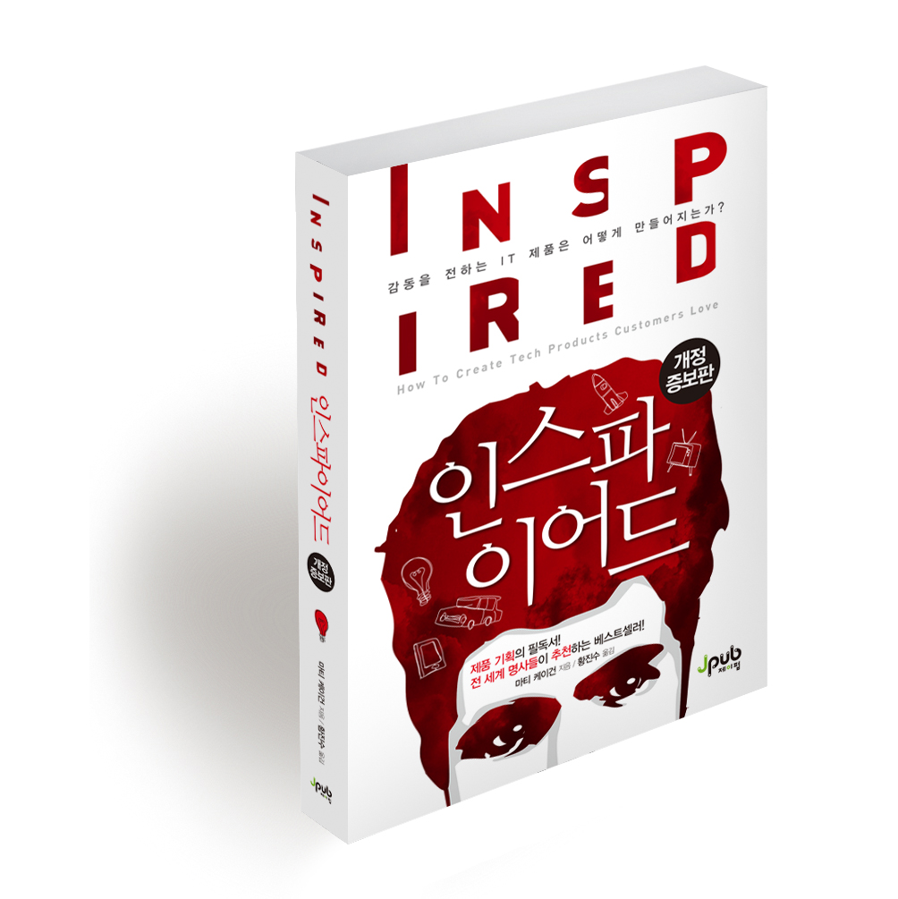

IT 제품 회사에서 제품은 어떻게 만들어야할까. 이를 제품관리자, 즉 PM 중심으로 풀어냈다.

[하드씽](http://www.kyobobook.co.kr/product/detailViewKor.laf?mallGb=KOR&ejkGb=KOR&barcode=9788947547031)에서 대표의 처절함과 피말리는 사투를 중심으로 이야기를 조망했던 것과 달리, 나같은 실무자가 체감할 수 있는 방법론 위주로 챕터가 구성돼어 두고두고 보기도 좋았다.(하드씽은 읽다보면 감정소비가 심해져서, 다시 보려면 정말 기합을 넣고 봐야한다)

## 쉽진 않지만, 분명 길은 있다

이상적인 이야기를 꺼낼때 고개를 저으며 '해봤는데 안돼' 라는 식으로 한계를 규정해버리면, 우리가 잘 알고 있는 최고의 기업들과 멀어지게 된다. 각자의 경험은 존중 받아야하지만, 실패한 경험만으로 낙담한다면 발전할 수 없다. 저자는 구글, 애플, 테슬라, 마이크로소프트 등 성공한 회사들에서 공통점을 찾아내고 어떻게하면 그와같은 수준에 다다를 수 있을지 방법을 상세히 알려준다.

이책을 읽으며 좋았던 것은, 내가 개발자 이상으로 영향력을 발휘하려 할 때, 내 의도와 행동에 자신감을 심어줬을 뿐만 아니라 구체적인 지침까지 알려준다는 것이다. 어설프게 보고들은 대로, 하던대로 하면 반드시 실패한다. 그리고 분명 실패를 낮추는 방법은 있다. 쉽지 않겠지만 철저하게 파고들어 책의 내용을 체득하고 싶어졌다. 일단은 FE 개발자로서 조금 더 커리어를 쌓고, 만에 하나 PM의 길을 간다면 꼭 필요할테니까.(혹은 창업)

## 좋은 조직

결국 IT 제품 회사에서 **제품팀이** 핵심이다. 자동차의 엔진처럼 정교하면서 에너지 넘치는 이 사람들을 어떻게 다루느냐가 성공을 좌우한다. Mission에 기반하여 팀을 조직하고, 여기에 모인 사람들이 최적으로 일할 수 있게 만드는 것이 PM의 역할이며, 이는 물리적/시간적으로 많은 수고를 동반한다. 그렇기에 PM은 미니 CEO다. 성공과 실패에서 오는 찬사와 비난을 받을 각오를 해야한다.

따라서 제품 관리자는 회사에서 가장 뛰어난 사람이어야한다. 그리고 그만큼 가장 넓은 권한과 책임을 갖는다. 책은 전설적인 제품관리자들의 여러 사례들울 소개하며, 그들이 어떻게 혁신과 성공을 이끌었는지 그 비화를 알려준다. 간혹 제품 관리자를 공공의 적으로 간주하며 그 필요성에 의문을 제기하는 경우들도 있는데, 정말 뛰어난 제품 관리자를 경험해 본다면 그런 이야기를 할 수 없다.

> 제품이 성공하면 팀의 모두가 제 역할을 잘 해냈기 때문이다. 하지만 제품이 실패하면 그것은 제품 관리자의 잘못이다.

제품 관리자 외에도, CEO/CTO/디자이너/엔지니어/마케터 등 다양한 레벨과 직군의 역할에 대해서도 자세히 이야기 하니, 조직에서 적재적소에 어떤 사람을 기용해야하는지 쉽게 이해할 수 있었다.

## 좋은 제품

책에서 가장 통감했던 부분은 **제품 로드맵이라는** 미신의 허구성을 드러낼 때다. 실제 실무자 입장에서 1년치 계획으로 고개를 빳빳이 치켜들고 있는 로드맵을 매번 보며 느끼는건, 부담감이 절반 이상이다. 해보면 다를테니까, 늘 그랬듯.

대신 성과에 집중하라고 이야기한다. 결과물은 누구도 알 수 없다. 바뀌는게 정상이다. 하지만 성과는 상대적으로 뚜렷하고 직접적인 문제해결의 지표가 될 수 있다. **성과 중심의 로드맵**이야말로 팀이 능동적으로 움직일 수 있게 해준다.

## 좋은 프로세스

빠른 실패. 이를 위한 실험 환경. 좋은 프로세스에 필요한 2가지다. 기업 또한 마치 연구소처럼 여러 실험을 진행하고 거기서 성공을 만들어야한다. 그리고 이 실험에 필요한 수많은 방법론은 제품을 만드는 사람으로서 잘 알고 있어야한다.

- 제품 발견 구조화
- 제품 발견 계획
- 아이디어 발상
- 프로토타이핑
- 제품 발견 테스트

위 기법들을 실제 실무에 적용하는데 예상되는 어려움/저항을 줄이기 위해 **변화 기법**을 설명하는 장에선, 나의 실패경험을 상기시키며 다시 시도해볼 수 있는 용기를 얻을 수 있었다. 나아가 위 프로세스를 확장하기 위해 혁신하는 방법까지 소개하며, 답이 없는걸까 고민했던 부분까지 길을 뚫어 주었다.

## 문화

결국 모든건 사람으로 귀결된다. 좋은 사람을 모으는데 그치지 않고, 치열하게 문화를 규정하고 고치고 가꾸며 지켜나가야한다. 단순히 HR리드를 뽑는다고 저절로 자라나지 않는다. 레고를 조립하듯 끼워맞춘다 한들, 약한 충격에도 쉽게 부숴지기 마련이다.

여러 파트(개발,디자인,마케팅,영업,사업개발,법률 등)에서 발생할 수 있는 문제점들을 잘 인지하고 있는 대표(혹은 PM)의 의지가 좋은 문화를 다질 수 있다. 그리고 그 위에서 **혁신과 실행력이** 꽃피어 진정 성공하는 제품을 만들어내게 되는 것이다.

---
