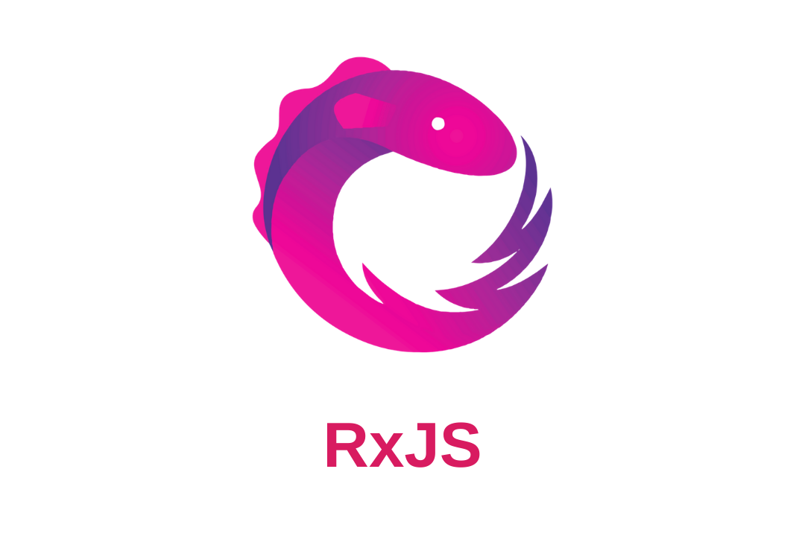

> "상상의 경계를 무너뜨릴 광기"
> <div style="text-align: right; font-style: italic;">닥터 스트레인지: 대혼돈의 멀티버스 中</div>

# 프론트 엔드, 왜 하나요?

저는 화면을 만드는 게 재밌습니다. 유저들이 UI를 통해 만족을 표현해 줄 때 큰 희열을 느낍니다. 연차가 쌓이며 더 복잡한 화면을 구현해 왔습니다. 다양한 이벤트와 비지니스 로직을 다루며, 동시에 유저가 만족을 느끼는 UI/UX를 구현했을 때 느끼는 성취감은 이루 말할 수 없습니다. 요구사항이 복잡하면 할수록 의지가 불탑니다.



처음부터 이렇게 의욕적이지는 않았습니다. 우연히 화려하고 복잡한 UI를 가진 앱을 볼때면 불안감이 생기곤 했습니다.

> _어떻게 만들었지? 회사에서 저렇게 만들어 달라고하면 어떡하지?_ 


하지만 RxJS를 익힌 이후로는 요구사항이 복잡할수록 오히려 도전욕구가 생겼고, 이에 화답하듯 RxJS는 빛을 발했습니다. 복잡한 요구사항을 해결해 나가면서 더이상 두려움을 느끼지 않게 됐습니다.


## (1)그래, 많이 들어봤는데... 꼭 써야해?

결론부터 말 하자면, 제 대답은 "아니요" 입니다. 기본적인 CRUD UI에는 필수 요소가 아닙니다. 오히려 오버 엔지니어링일 확률이 높습니다.

하지만, 한가지 확실하게 말씀드릴 수 있는 부분이 있습니다.

"앞으로 프론트 엔드 커리어를 계속 쌓아가실 생각이라면, 마냥 피할 수 없습니다."


현대에 이르러 브라우저의 영역은 매우 넓어졌고 **다양한 데이터**를 다루게 됐습니다. 왠만한 어플리케이션은 웹으로 작성이 가능해졌습니다. 그리고 웹 세상에서 데이터는 **이벤트**를 통해 전달됩니다.

- DOM Event
- User Event
- Network Event
- Device Event
- ...

이벤트는 모두 비동기로 동작합니다. 즉! 프론트 개발자는 **수많은 비동기 코드를** 다뤄야한다는 뜻입니다. 그렇게 날로 복잡해지는 비동기 코드를 다루기 위해, 일반적으로 2가지 테크닉을 사용합니다. 

- Callback
- Promise

### UI 복잡도 == 이벤트 복잡도 

복잡한 UI는 금새 다양한 데이터(=이벤트)로 엮이고, 어느 지점부터 Callback과 Promise 만으로 **원하는 타이밍에** 원하는 동작을 수행하기 점점 버거워집니다. 

> A이벤트가 n번 이상 발생한 이후 B이벤트가 발생하면 네트워크 요청을 실행하시오. 네트워크 요청중 C이벤트가 1번이라도 발생했다면 네트워크 요청을 취소하고 D 동작을 실행하시오

Callback과 Promise만으로 위 시나리오를 구현하기란 쉽지 않습니다. 부가적인 상태를 관리해야하기 때문에 코드가 매우 복잡하고 가독성이 떨어지게 됩니다.

```js
const aEventThreshold = 3;

let aCount = 0;
let bCount = 0;
let networkRequestInProgress = false;

// A 이벤트 핸들러
document.getElementById('buttonA').addEventListener('click', () => {
  aCount++;
  console.log(`A 이벤트 발생, 현재 카운트: ${aCount}`);

  if (bCount >= 1) {
    startNetworkRequest();
  }
});

// B 이벤트 핸들러
document.getElementById('buttonB').addEventListener('click', () => {
  bCount++;
  if (aCount >= aEventThreshold && !networkRequestInProgress) {
    console.log('네트워크 호출 조건 만족')
    startNetworkRequest();
  }
});

// C 이벤트 핸들러
document.getElementById('buttonC').addEventListener('click', () => {
  if (networkRequestInProgress) {
    tap(() => console.log('C 이벤트 발생, 취소 시그널 전달')),
    cancelNetworkRequest();
  }
  invokeEventD();
});

// 네트워크 요청 관리
let currentRequest = null;

function startNetworkRequest() {
  console.log('네트워크 요청 시작');
  networkRequestInProgress = true;

  // fetchWithCancel 호출
  currentRequest = fetchWithCancel('https://jsonplaceholder.typicode.com/posts');

  currentRequest.promise
    .then(data => {
      console.log('네트워크 요청 완료:', data);
      networkRequestInProgress = false;
    })
    .catch(err => {
      if (err.name === 'AbortError') {
        console.log('네트워크 요청 취소됨');
      } else {
        console.error('네트워크 요청 중 에러 발생:', err);
      }
      networkRequestInProgress = false;
    });
}

// 네트워크 요청 함수 (AbortController 포함)
function fetchWithCancel(url) {
  const controller = new AbortController();
  const signal = controller.signal;

  const fetchPromise = fetch(url, { signal }).then(response => response.json());

  return { promise: fetchPromise, abort: () => controller.abort() };
}

// 네트워크 요청 취소
function cancelNetworkRequest() {
  if (currentRequest) {
    console.log('네트워크 요청 취소');
    currentRequest.abort();
    networkRequestInProgress = false;
    currentRequest = null;
  }
}

function invokeEventD() {
  console.log('D 동작 실행');
}
```

 개발자가 상태를 직접 관리해야하며, 새로운 이벤트나 조건을 추가할 때 유지보수 비용이 증가합니다. 코드를 위아래로 훑어가며 비동기 흐름을 따라가기 쉽지 않습니다.

즉 시간이 흘러 버그가 숨어들기 좋은 코드라는 뜻 입니다. 불안합니다.

이런 복잡한 타이밍 컨트롤을 어떻게 **안정적으로** 할 수 있을까요? 이제 방안을 모색해야 할 순간입니다.


[RxJS](https://rxjs.dev/)는 이러한 '타이밍' 컨트롤을 도와줍니다. Observable이라는 개념을 도입하여 '시간' 위에서 데이터를 핸들링하도록 설계됐습니다. 마치 '타임스톤' 처럼 말이죠.

RxJS로 재구성해보겠습니다.

```js
import { fromEvent, combineLatest, Subject, from } from 'rxjs';
import { scan, filter, switchMap, takeUntil, tap, finalize, shareReplay } from 'rxjs/operators';

// 이벤트 스트림 생성
const aEvent$ = fromEvent(document.getElementById('buttonA'), 'click'); // A 이벤트
const bEvent$ = fromEvent(document.getElementById('buttonB'), 'click'); // B 이벤트
const cEvent$ = fromEvent(document.getElementById('buttonC'), 'click'); // C 이벤트

const aEventThreshold = 3;

// A 이벤트 발생 횟수 상태 관리
const aCount$ = aEvent$.pipe(scan(count => count + 1, 0));

// 네트워크 이벤트 트리거 조건: A 이벤트가 n번 이상, B이벤트 1번 이상 발생
const trigger$ = combineLatest([aCount$, bEvent$]).pipe(
  filter(([aCount, bEvent]) => aCount >= aEventThreshold && bEvent)
  tap(() => console.log('네트워크 호출 조건 만족'))
);

// C 이벤트로 네트워크 요청 취소 시그널 생성
const cancel$ = cEvent$.pipe(
  tap(() => console.log('C 이벤트 발생, 취소 시그널 전달')),
  shareReplay(1) // 여러 구독에서 재사용 가능하도록 공유
);

// 네트워크 요청
const networkRequest$ = trigger$.pipe(
  switchMap(() => {
    const { promise, abort } = fetchWithCancel('https://jsonplaceholder.typicode.com/users/7?_delay=3000');

    // Observable로 변환하여 취소 관리
    const fetchObservable$ = from(promise).pipe(
      takeUntil(cancel$), // C 이벤트로 취소 처리
      finalize(() => {
        console.log('네트워크 요청 취소');
        abort();
      })
    );

    return fetchObservable$;
  })
);

// 네트워크 요청 완료 시 동작
networkRequest$.subscribe({
  next: data => console.log('네트워크 요청 완료:', data),
  error: err => console.log('네트워크 요청 중 에러 발생:', err),
});

// 네트워크 요청 함수 (AbortController 포함)
function fetchWithCancel(url) {
  const controller = new AbortController();
  const signal = controller.signal;

  const fetchPromise = fetch(url, { signal }).then(response => response.json());

  return { promise: fetchPromise, abort: () => controller.abort() };
}

function invokeEventD() {
  console.log('D 동작 실행');
}
```

처음보는 함수들 때문에 놀라셨겠지만, 당장은 자세히 모르셔도 괜찮습니다. 절차적으로 작성되는
- 조건문
- 반복문
- 계산
들을 추상화한 함수들 입니다. 가독성을 높이고 프로시져를 재사용한다는 느낌만 가져가도 괜찮습니다.

이제 요구사항이 늘어나거나 변경돼도 간단히 새로운 연산자를 조합하면 끝입니다. 여러분이 직접 상태 변경을 추적하거나, 이벤트의 코드를 변경할 필요가 없습니다.

그것만으로도 이미 강력함을 느끼셨으리라 생각합니다. React가 처음 나왔을 때처럼 말이죠.

#### React
- UI를 선언적으로 표현

#### RxJS
- 이벤트 흐름을 선언적으로 표현

## (2)그래, 많이 들어봤는데... React랑 어울려?

본격적으로 RxJS를 익히고 React에 적용하려 했을 때, 막막한 면이 있었습니다. 각각의 메커니즘은 이해를 했는데, 이를 함께 사용하기가 까다로웠습니다. 동작한다 하더라도, 가독성이 무척 떨어졌습니다.

애초에 React는 입력 데이터를 UI로 출력하는 데만 관심이 있을 뿐, 비동기 이벤트를 다루는 것은 크게 관심이 없습니다. 게다가 React의 데이터 처리 방식은 근본적으로 RxJS와 방향이 다릅니다. 

> Some popular libraries implement the “push” approach where computations are performed when the new data is available. React, however, sticks to the “pull” approach where computations can be delayed until necessary.
> <div style="text-align: right; font-style: italic;"><a href="https://legacy.reactjs.org/docs/design-principles.html#scheduling" target="blank">React docs, design principles</a></div>

### React
- **위에서 아래로 흐르는** 데이터를 React가 스케쥴링하여 UI로 표현
- Pull Approach

### RxJS 
- 위/아래 가리지 않고 **시간에 따라 흐르는** 데이터를 핸들링
- Push Approach


태생부터 결이 다른 라이브러리를 동시에 사용하려니 불편함을 느낄 수밖에 없었습니다. 하지만 각기 오래된 라이브러리이고, 누군가 이미 불편함을 해결했으리라 생각했습니다. 다행히 몇몇 후보들을 발견했고, 그 중 [Observable-Hooks](https://observable-hooks.js.org/)가 단연 뛰어나 보였습니다.

# Observable :heart: Hook!

> "타임스톤"은 무척 강력한 도구지만, 왠만한 실력자가 아닌 이상 쉽게 다룰 수 없습니다. "아가모토의 눈"은 이를 효율적으로 제어하기 위한 도구입니다.


RxJS가 **타임 스톤**이라면, [Observable-Hooks](https://observable-hooks.js.org/)는 이를 React에서 수월하게 사용하기 위한 **아가모토의 눈**이라 할 수 있습니다. 


잠시 아래 인터페이스들을 살펴볼까요? React 개발자라면 매우 친숙할 모습입니다.

- `useObservableState()`
- `useObservableCallback()`
- `useObservableRef()`
- `useLayoutSubscription()`
<sub>(더 많은 hook들이 존재하지만 우선 이정도만 소개하고 넘어 가겠습니다.)</sub>

React Component 내에서 위 hook들에게 RxJS 함수들을 제공하면, 깔끔하게 원하는 UI를 원하는 타이밍에 렌더링할 수 있습니다. 아무리 많은 이벤트와 데이터가 얽혀있더라도요!

#### Hook
- React Component가 데이터를 pull해오는 메커니즘을 제공
- 함수를 넘김 수 있음

#### RxJS
- React 스케쥴에 종속되지 않는 자유로운 push 파이프라인 제공
- 파이프라인은 함수이며 hook과 결합 가능


조금 감이 잡히시나요?


# Talk is cheap. Show me the code

조금 더 실용적인 예제로 넘어가 보겠습니다.

> _아래 코드는 react-query, react-hook-form을 알고 있다는 가정하에 작성했습니다._

### 요구사항

- zip 파일 생성 요청
- 요청 id를 통해 polling
- zip 파일이 생성이 완료되면 다운로드

### API Spec
```js
[POST] `/api/zip`
[Body]
- data: JSON
[Response]
- requestId: string;

[GET] `/api/zip/<requestId: string>`
[Response]
- downloadUrl: string | null;

```

이제 컴포넌트로 들어가볼까요?

## 일반적인 코드

```jsx
const MyComponent = () => {
  const methods = useForm();
  const { mutateAsync, error: generateError } = useMutation({
    mutationFn: (values) => fetch('/api/zip', {
      method: 'POST',
      body: JSON.stringify(values),
    })
  });
  cons [requestId, setRequestId] = useState(null);

  const { data, error: queryError } = useQuery(
    ['pollDownloadUrl', requestId],
    () => fetch(`/api/zip/${requestId}`),
    {
      enabled: Boolean(requestId), // requestId가 존재하고 폴링이 활성화된 경우에만 실행
      refetchInterval: (data) => {
        if (data.downloadUrl) return undefined;
        return 5000; // 5초마다 폴링
      },
    }
  );

  useEffect(() => {
    if (data?.downloadUrl) {
      downloadFile(data.downloadUrl);
      setRequestId(null);
      toast.dismiss();
    }
  }, [data]);

  useEffect(() => {
    if (generateError || queryError) {
      toast.error((generateError || queryError).message);
    }
  }, [generateError, queryError]);

  const onSubmit = async (values) => {
    try {
      toast('Generating and compressing files');
      const response = await mutateAsync(values);
      
      setRequestId(response.requestId);
    } catch (err) {
      toast.error(err.message);
    }
  };

  return (
    <form onSubmit={methods.handleSubmit(onSubmit)}>
      {/* ... */}
    </form>
  );
};
```

뭐... 나쁘진 않습니다만, 여러 useEffect 훅과 useQuery 훅을 사용하여 폴링 로직, 오류 처리, 상태 업데이트를 관리한다는걸 빼고 말이죠.

이로 인해 코드가 분산되고 관리하기 복잡해질 수 있습니다. 개발자에게 오버헤드가 생기기 쉽고, 이는 변경사항에 취약하게 만듭니다.

## Observable-Hooks 코드

```jsx
const MyComponent = () => {
  const methods = useForm();
  const [onGenerateResponse, onPollingResponse$] = useObservableCallback((generateResponse$) =>
    generateResponse$.pipe(
      tap(() => {
        toast('Generating and compressing files');
      }),
      switchMap((response) => {
        return interval(1000 * 5).pipe(
          switchMap(() => fetch(`/api/zip/${response.requestId}`)),
          catchError((error) => {
            toast.error(error.message);
            return EMPTY;
          }),
          takeWhile((res) => {
            return !isString(res.downloadUrl);
          }, true),
        );
      }),
    ),
  );

  useSubscription(onPollingResponse$, ({ downloadUrl }) => {
    if (downloadUrl) {
      downloadFile(downloadUrl);
      toast.dismiss();
    }
  });

  const onSubmit = (values) => {
    fetch('/api/zip', {
      method: 'POST',
      body: JSON.stringify(values),
    })
      .then(onGenerateResponse)
      .catch((err) => toast.error(err.message));
  }

  return (
    <form onSubmit={methods.handleSubmit(onSubmit)}>
      {/* ... */}
    </form>
  );
}
```

Observable-hook의 useObservableCallback과 switchMap을 사용하면 생성, 폴링, 오류 처리를 하나의 파이프라인에서 관리합니다. 이는 비동기 작업의 흐름을 보다 직관적이고 선언적으로 표현할 수 있게 해줍니다.

**이벤트(비동기 코드)** 관리가 Array의 map/filter/reduce를 다루듯 단순해 졌습니다.

# 점진적 적용 및 개선

> 타임스톤은 시간을 자유자재로 다룰 수 있는 무척 강력한 도구지만, 잘못 사용할 경우 영원히 반복되는 시간에 갇히거나 존재가 소멸할 수 있습니다.

이토록 멋진 RxJS지만, 명백한 제약조건이 있습니다. 

#### [Learning Curve? Learning Cliff!](https://x.com/hoss/status/742643506536153088)

- 추가적인 개발 패러다임을 익힐 것을 요구
- 수 많은 operator
- 까다로운 디버깅

그래서! 저는 단계별로 학습하길 권장드립니다.

## Operator보다 Observable

보통 RxJS의 수많은 operator에 압도되곤 합니다. 모든 operator를 익히기보다, Observable의 메커니즘에 집중하여, 간단한 사용처를 찾는 것부터 시작할 것을 추천드립니다.

```jsx
export function List() {
  const { data, isLoading } = useList();
  const invalidate = useInvalidateList();

  // 너무 많은 요청을 방지하기 위한 쓰로틀링
  const [throttledOnClick, throttledOnClickStream$] =
    useObservableCallback<PressEvent>((event$) =>
      event$.pipe(throttleTime(2000)),
    );

  useSubscription(throttledOnClickStream$, invalidateList);

  return (
    <div className="flex flex-col">
      <RefreshButton onPress={throttledOnClick} />

      <Table loading={isLoading} rows={data} />
    </div>
  );
}
```

보다 복잡한 예시들은 검색을 통해 찾을 수 있습니다. 일단 동작시켜보고 operator가 어떻게 동작하는지 체감해본다면 빠르게 익히실 수 있습니다.

## Provider를 통한 상태전파 및 Boundary 설정

React에서 제공하는 Provider를 통해 상태를 전파할 수 있습니다. 원래 Provider는 상태가 변하면 하위 컴포넌트들을 모두 리렌더링 하지만, Observable 객체는 파이프라인에 불과하고 변하는 건 그 안에 흐르는 데이터이기 때문에 리렌더링이 발생하지 않습니다. 이를 통해 자식에서 부모/형제로 상태를 전파하기 매우 수월합니다.

단순한 상태 전파라면 다른 라이브러리들을 사용하는 게 나을 수도있지만, 저는 일부러 Provider를 사용합니다.

1. 전역 상태를 최소화하여 사이드 이펙트를 방지한다.
1. JSX문법으로 명확한 Boundary(경계)를 설정할 수 있다.

경계를 설정하는 것만으로도 디버깅에 매우 큰 도움이 됩니다. 다른 상태들과 엮여 의도치 않은 동작이 일어나는 것을 방지하기도 합니다.

## 커스텀 Debug 함수

> 출처: https://blog.angular-university.io/debug-rxjs/

```ts
import {Observable} from 'rxjs';
import {tap} from 'rxjs/operators';

export enum RxJsLoggingLevel {
    TRACE,
    DEBUG,
    INFO,
    ERROR
}

let rxjsLoggingLevel = RxJsLoggingLevel.INFO;

export function setRxJsLoggingLevel(level: RxJsLoggingLevel) {
    rxjsLoggingLevel = level;
}


export const debug = (level: number, message:string) =>
  (source: Observable<any>) => source
    .pipe(
      tap(val => {
        if (level >= rxjsLoggingLevel) {
            console.log(message + ': ', val);
        }
      })
    );
```

위 커스텀 디버그 함수를 통해 보다 편리하게 디버깅을 수행할 수도 있습니다.

```ts
countdownStartTime$.pipe(
  debug(LogginLevel.DEBUG, "Start Time")
  distinctUntilChanged(),
  switchMap(() =>
    of(animationFrameScheduler.now(), animationFrameScheduler).pipe(
      repeat(),
      map((startTime) => Math.floor((Date.now() - startTime) / 1000)),
      debug(LogginLevel.DEBUG, "How many left?")
      distinctUntilChanged(),
      take(expiresIn),
      scan((timeLeft) => timeLeft - 1, expiresIn),
    ),
  ),
),
```

이 외에도 [다양한 React 예제](https://observable-hooks.js.org/examples/)들이 있으니 따라해보시는 걸 추천드립니다.

# 소서러 슈프론트:star:(?)

RxJS를 왜 배워야하는지 고민하던 시기가 있었습니다. 도움이 될 것 같으면서도 한편으로 크게 와닿지 않아서, 간단히 공부하기에 그쳤었죠. 하지만 지금은 무척 즐겨 사용하는 Goto Library 중 하나가 됐습니다. 복잡한 UI를 다루면서 효용성을 많이 깨닫고 아직도 끊임없이 수련중입니다. (스트레인지까지는 아니더라도, 웡 수준만 돼도 기쁠거 같습니다)


 닥터 스트레인지도 타임스톤을 자유자재로 다루기 위해 힘든 역경을 지나왔습니다. 더딘 발전에 괴로워하며, 사랑하는 사람을 떠나보내기도 하고 :cry: 스승을 잃고 무거운 책임감을 받아드리기에 이르렀습니다. 
 
그렇게 마침내 최강의 소서러 슈프림으로 등극합니다. 그리고 예로부터 소서러 슈프림은
- 우주의 질서와 균형을 유지하며
- 우주의 모든 존재를 외부 위협으로부터 지켜왔습니다.

### 아름답고 취약한 프론트엔드

작은 기능 추가로 수많은 코드가 바뀔 수 있습니다. 그 안에는 UI 컴포넌트, 비동기 로직, 계산, 퍼포먼스 등 다양한 고려사항이 내포되어 있습니다. 

"작은 변경이니까 금방 끝나요"

이보다 확실한 야근 플래그가 있을까요?


수많은 가능성을 고려하고 검증해야 하는 프론트엔드 개발자!
- 코드의 질서와 균형을 유지하며
- 수많은 이벤트와 데이터, 타이밍의 위협으로부터 프로젝트를 지켜야합니다.

### RxJS: 성장의 경계를 무너뜨릴 신기

프로젝트가 성장하면 관리 지점도 늘어납니다. 뿌듯함과 동시에 부담도 배가 되죠. 때에 따라 극한의 상황을 마주칠 수 있습니다. 물론 준비된 개발자라면 커리어를 한단계 도약시킬 기회로 삼을 수도 있겠죠.

오늘도 성장에 목마른 프론트 개발자분들께 [RxJS](https://rxjs.dev/)를, 나아가 React 개발자에게는 [Observable-Hooks](https://observable-hooks.js.org/)까지 적극 권장하며 이만 줄이겠습니다. 

피드백은 언제나 환영입니다, Adios!
